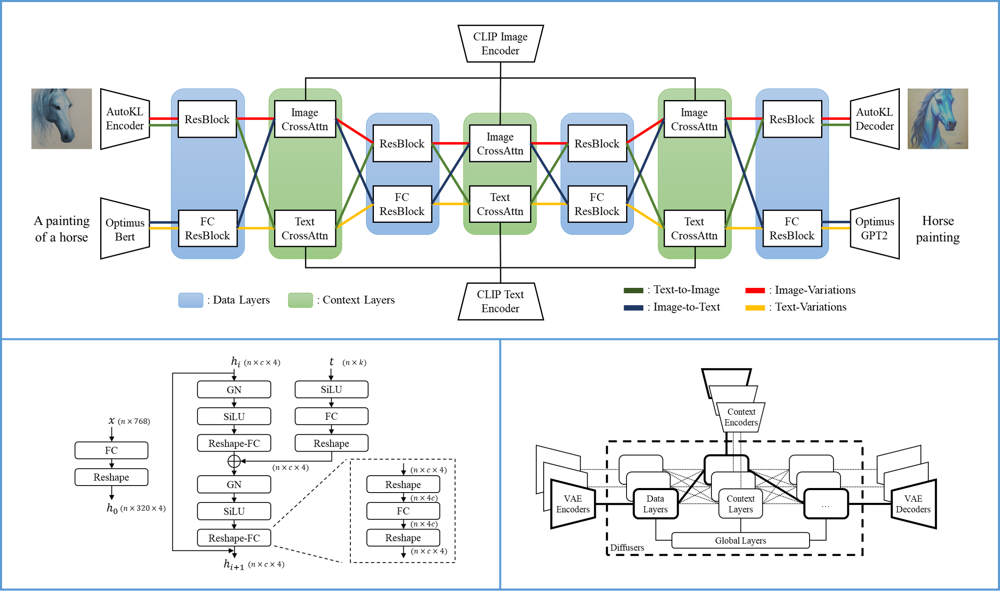

# Versatile Diffusion

[](https://huggingface.co/spaces/shi-labs/Versatile-Diffusion)
[](https://pytorch.org/)
[](https://opensource.org/licenses/MIT)

This repo hosts the official implementary of:

[Xingqian Xu](https://ifp-uiuc.github.io/), Atlas Wang, Eric Zhang, Kai Wang, and [Humphrey Shi](https://www.humphreyshi.com/home), **Versatile Diffusion: Text, Images and Variations All in One Diffusion Model**, [Paper arXiv Link](https://arxiv.org/abs/2211.08332).

## News

- **[2023.02.07]: Our new demo is up and running on [🤗Hugging Face](https://huggingface.co/spaces/shi-labs/Versatile-Diffusion)!**
- **[2023.02.07]: A major update on Versatile Diffusion's code in which model codes are better structured, and all applications are supported in a convenience WebUI.**
- [Previous]: Please see the deprecated [README](https://github.com/SHI-Labs/Versatile-Diffusion/blob/master/README_deprecated.md).

## Introduction

We built **Versatile Diffusion (VD), the first unified multi-flow multimodal diffusion framework**, as a step towards **Universal Generative AI**. Versatile Diffusion can natively support image-to-text, image-variation, text-to-image, and text-variation, and can be further extended to other applications such as semantic-style disentanglement, image-text dual-guided generation, latent image-to-text-to-image editing, and more. Future versions will support more modalities such as speech, music, video and 3D.

<p align="center">
  
</p>

## Network and Framework

One single flow of Versatile Diffusion contains a VAE, a diffuser, and a context encoder,  and thus handles one task (e.g., text-to-image) under one data type (e.g., image) and one context type (e.g., text). The multi-flow structure of Versatile Diffusion shows in the following diagram:

<p align="center">
  
</p>

According to Versatile Diffusion, we further proposed a generalized multi-flow multimodal framework with VAEs, context encoders, and diffusers containing three layers (i.e., global, data, and context layers). To involve a new multimodal task in this framework, we bring out the following requirements:

* The design of the core diffuser should contain shared global layers, swappable data, and context layers that will be correspondingly activated based on data and context types.
* The choice of VAEs should smoothly map data onto highly interpretable latent spaces.
* The choice of context encoders should jointly minimize the cross-modal statistical distance on all supported content types.


## Performance

<p align="center">
  
  
  
</p>

## Data

We use Laion2B-en with customized data filters as our main dataset. Since Laion2B is very large and typical training is less than one epoch, we usually do not need to download the complete dataset for training. Same story for VDs.

Directory of Laion2B for our code:

```
├── data
│   └── laion2b
│       └── data
│           └── 00000.tar
│           └── 00000.parquet
│           └── 00000_stats.jsom_
│           └── 00001.tar
│           └── ...
```

These compressed data are generated with img2dataset API [official github link](https://github.com/rom1504/img2dataset).

## Setup

```
conda create -n versatile-diffusion python=3.8
conda activate versatile-diffusion
conda install pytorch==1.12.1 torchvision=0.13.1 -c pytorch
[Alternatively] pip install torch==1.12.1+cu113 torchvision==0.13.1+cu113 torchaudio==0.12.1 --extra-index-url https://download.pytorch.org/whl/cu113
pip install -r requirement.txt
```

## Pretrained models

All pretrained models can be downloaded from Hugging Face [link](https://huggingface.co/shi-labs/versatile-diffusion/tree/main/pretrained_pth). The pretrained folder should include the following files:

```
├── pretrained
│   └── kl-f8.pth
│   └── optimus-vae.pth
│   └── vd-four-flow-v1-0.pth
│   └── vd-four-flow-v1-0-fp16.pth
```

Model named with **-fp16** are models with float16 parameters, which is half size of the float32 models.

## Inference

We now provide a convenience WebUI ```app.py``` that supports all applications. Start the WebUI with the following command:

```
python app.py
```

The WebUI contains the following new features:

- Improved and enhanced Image-Variation
- New Triple-Context Image Blender (support two images with optional masks + text)
- New Multi-Context Image Blender (support up to four images with optional masks + text)

The following old features have been temporary disables:

- I2T2I is temporarily offline. We are actively seeking a better way of image editing.

## Training

We will try our best to make it out soon.

## Gallery

Text-to-Image

<p align="center">
  
</p>

Image-Variation

<p align="center">
  
</p>

Image-Variation with Semantic Focus

<p align="center">
  
</p>

Dual-guided

<p align="center">
  
</p>

## Citation

```
@article{xu2022versatile,
	title        = {Versatile Diffusion: Text, Images and Variations All in One Diffusion Model},
	author       = {Xingqian Xu, Zhangyang Wang, Eric Zhang, Kai Wang, Humphrey Shi},
	year         = 2022,
	url          = {https://arxiv.org/abs/2211.08332},
	eprint       = {2211.08332},
	archiveprefix = {arXiv},
	primaryclass = {cs.CV}
}
```

## Acknowledgement

Part of the codes reorganizes/reimplements code from the following repositories: [LDM official Github](https://github.com/CompVis/latent-diffusion), which also oriented from [DDPM official Github](https://github.com/lucidrains/denoising-diffusion-pytorch).
