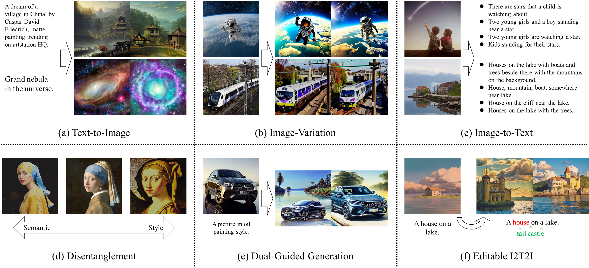
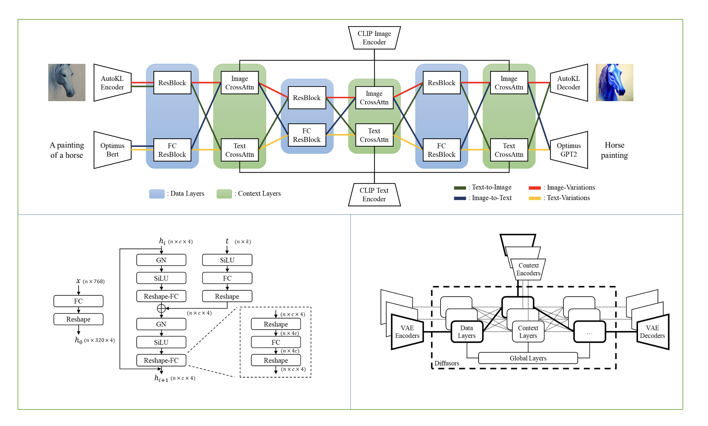
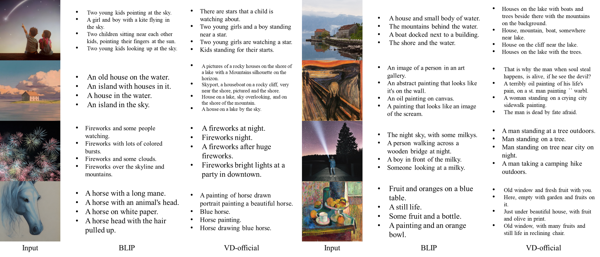
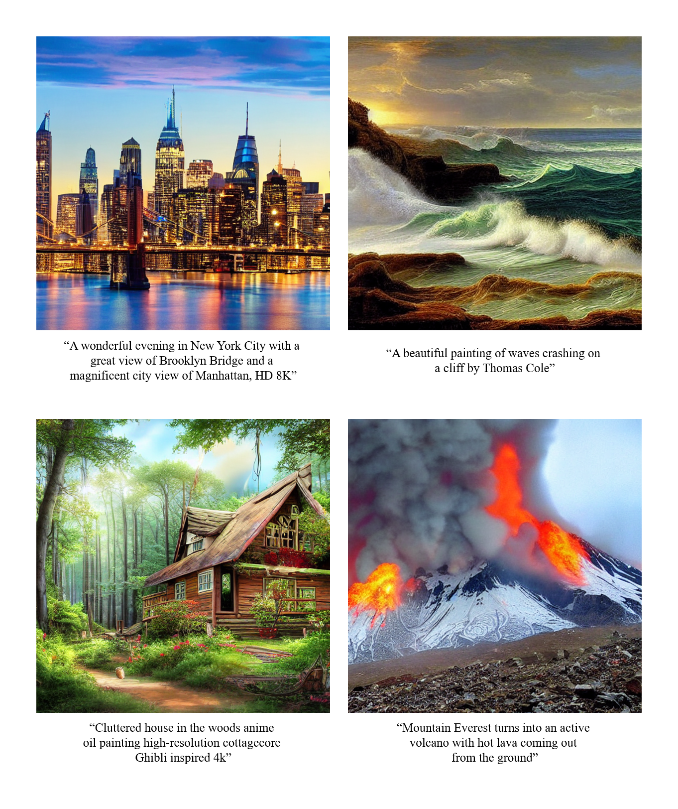
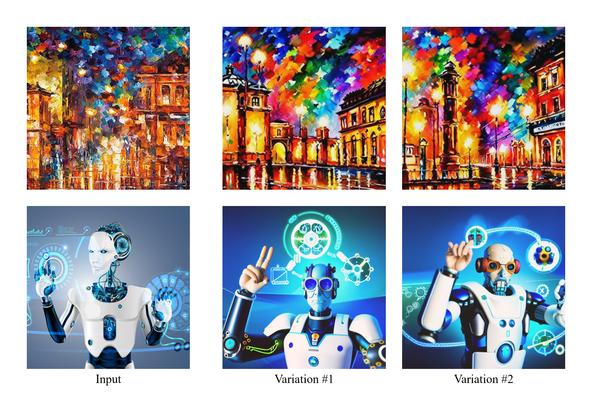
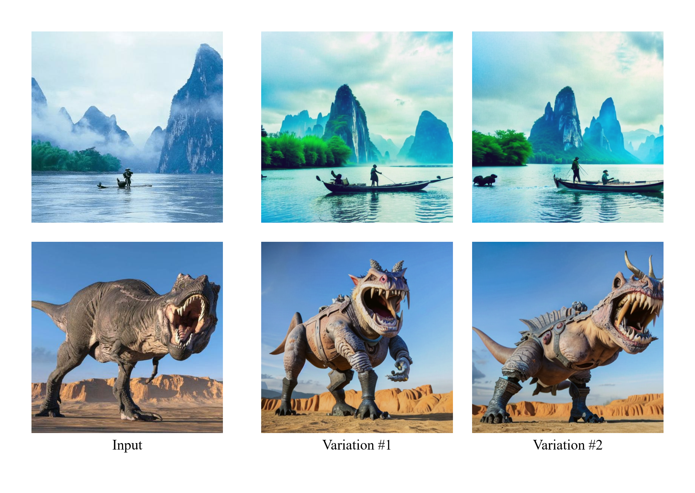

# Versatile Diffusion

[](https://huggingface.co/spaces/shi-labs/Versatile-Diffusion)
[](https://pytorch.org/)
[](https://opensource.org/licenses/MIT)

This repo hosts the official implementary of:

[Xingqian Xu](https://ifp-uiuc.github.io/), Atlas Wang, Eric Zhang, Kai Wang, and [Humphrey Shi](https://www.humphreyshi.com/home), **Versatile Diffusion: Text, Images and Variations All in One Diffusion Model**, [Paper arXiv Link](https://arxiv.org/abs/2211.08332).

## News

- [2022.11.23]: Versatile Diffusion are now released in [```diffuser==0.8.0```](https://github.com/huggingface/diffusers/releases) library🚀!
- [2022.11.21]: ```inference.py``` now supports ```--fp16```, reducing both GPU memory and model size by half.
- [2022.11.19]: We add a simplified evaluation script ```inference.py``` that supports all mentioned applications.
- **[2022.11.16]: Our demo is up and running on [🤗HuggingFace](https://huggingface.co/spaces/shi-labs/Versatile-Diffusion)!**
- [2022.11.14]: Part of our evaluation code and models are released!
- [2022.11.12]: Repo initiated

## Introduction

We built **Versatile Diffusion (VD), the first unified multi-flow multimodal diffusion framework**, as a step towards **Universal Generative AI**. Versatile Diffusion can natively support image-to-text, image-variation, text-to-image, and text-variation, and can be further extended to other applications such as semantic-style disentanglement, image-text dual-guided generation, latent image-to-text-to-image editing, and more. Future versions will support more modalities such as speech, music, video and 3D.

<p align="center">
  
</p>

## Network and Framework

One single flow of Versatile Diffusion contains a VAE, a diffuser, and a context encoder,  and thus handles one task (e.g., text-to-image) under one data type (e.g., image) and one context type (e.g., text). The multi-flow structure of Versatile Diffusion shows in the following diagram:

<p align="center">
  
</p>

According to Versatile Diffusion, we further proposed a generalized multi-flow multimodal framework with VAEs, context encoders, and diffusers containing three layers (i.e., global, data, and context layers). To involve a new multimodal task in this framework, we bring out the following requirements:

* The design of the core diffuser should contain shared global layers, swappable data, and context layers that will be correspondingly activated based on data and context types.
* The choice of VAEs should smoothly map data onto highly interpretable latent spaces.
* The choice of context encoders should jointly minimize the cross-modal statistical distance on all supported content types.


## Performance

<p align="center">
  
  
  
</p>

## Data

We use Laion2B-en with customized data filters as our main dataset. Since Laion2B is very large and typical training is less than one epoch, we usually do not need to download the complete dataset for training. Same story for VDs.

Directory of Laion2B for our code:

```
├── data
│   └── laion2b
│       └── data
│           └── 00000.tar
│           └── 00000.parquet
│           └── 00000_stats.jsom_
│           └── 00001.tar
│           └── ...
```

These compressed data are generated with img2dataset API [official github link](https://github.com/rom1504/img2dataset).

## Setup

```
conda create -n versatile-diffusion python=3.8
conda activate versatile-diffusion
conda install pytorch==1.12.1 torchvision=0.13.1 -c pytorch
pip install -r requirement.txt
```

## Pretrained models

Useful pretrained models can be downloaded from HuggingFace [link](https://huggingface.co/shi-labs/versatile-diffusion/tree/main/pretrained_pth). The pretrained folder should include the following files:

```
├── pretrained
│   └── kl-f8.pth
│   └── optimus-vae.pth
│   └── vd-four-flow-v1-0.pth (originally named vd-official.pth)
│   └── vd-four-flow-v1-0-fp16.pth
```

Model named with **-fp16** are models with float16 parameters and correpondingly used in ```--fp16``` evaluation. The float16 models are half of the size comparing to the float32 models.

Please refer to this [doc](https://github.com/SHI-Labs/Versatile-Diffusion/blob/master/README_extra.md) to download VD-DC and baselines models. 

## Evaluation

Here is the one-line shell command to evaluate VD four-flow models with multiple GPUs.

```
python main.py --config vd_official_eval --gpu 0 1 2 3 4 5 6 7 --eval 99999
```

The corresponding evaluation configs can be found in ```./configs/experiment/vd_official_eval.yaml```. There are useful information in the config. You can easy customized it and run your own batched evaluations.

For the commands above, you also need to:
* Create ```./pretrained``` and move all downloaded pretrained models in it.
* Create ```./log/vd_nodataset/99999_eval``` for evaluations on Versatile Diffusion

Besides, we provide a simple evaluation script ```inference.py``` that support all applications mentioned in the paper. Examples are below:

```
python inference.py --gpu 0 --app text-to-image --prompt "a dream of a village in china, by Caspar David Friedrich, matte painting trending on artstation HQ" --seed 0 --save log/text-to-image.png
python inference.py --gpu 0 --app image-variation --image assets/space.jpg --seed 8 --save log/image-variation.png --coloradj simple
python inference.py --gpu 0 --app image-to-text --image assets/space.jpg --seed 8
python inference.py --gpu 0 --app text-variation --prompt "a pink car" --seed 8
python inference.py --gpu 0 --app disentanglement --image assets/vermeer.jpg --seed 8 --save log/disentanglement.png --coloradj simple --dislevel -2
python inference.py --gpu 0 --app dual-guided --image assets/benz.jpg --prompt "cyberpunk 2077" --seed 22 --save log/dual-guided.png --coloradj none --dgmixing 0.7
python inference.py --gpu 0 --app i2t2i --image assets/ghibli.jpg --nprompt "white house" --pprompt "tall castle" --seed 20 --save log/i2t2i.png --coloradj simple
```

You can also inference with float16 by adding a tag ```--fp16``` to each command. It doubles the running speed using a half size pretrained model ```vd-***-fp16.pth```. You will also need to update transformers to 4.24.0. Below is an example command using float16:

```
python inference.py --gpu 0 --app image-variation --image assets/space.jpg --seed 8 --save log/image-variation.png --coloradj simple --fp16
```

For baseline experiments and experiments on VD-DC, please refer to this [doc](https://github.com/SHI-Labs/Versatile-Diffusion/blob/master/README_extra.md)

## Training

Coming soon

## Gallery

Text-to-Image

<p align="center">
  
</p>

Image-Variation

<p align="center">
  
</p>

Image-Variation with Semantic Focus

<p align="center">
  
</p>

Dual-guided

<p align="center">
  
</p>

## Citation

```
@article{xu2022versatile,
	title        = {Versatile Diffusion: Text, Images and Variations All in One Diffusion Model},
	author       = {Xingqian Xu, Zhangyang Wang, Eric Zhang, Kai Wang, Humphrey Shi},
	year         = 2022,
	url          = {https://arxiv.org/abs/2211.08332},
	eprint       = {2211.08332},
	archiveprefix = {arXiv},
	primaryclass = {cs.CV}
}
```

## Acknowledgement

Part of the codes reorganizes/reimplements code from the following repositories: [LDM official Github](https://github.com/CompVis/latent-diffusion), which also oriented from [DDPM official Github](https://github.com/lucidrains/denoising-diffusion-pytorch).
