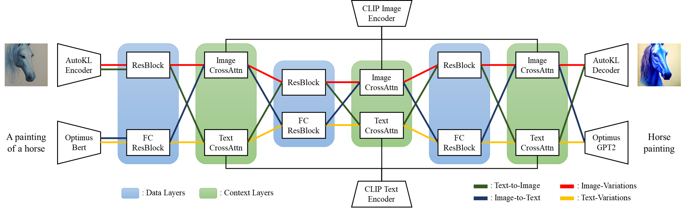
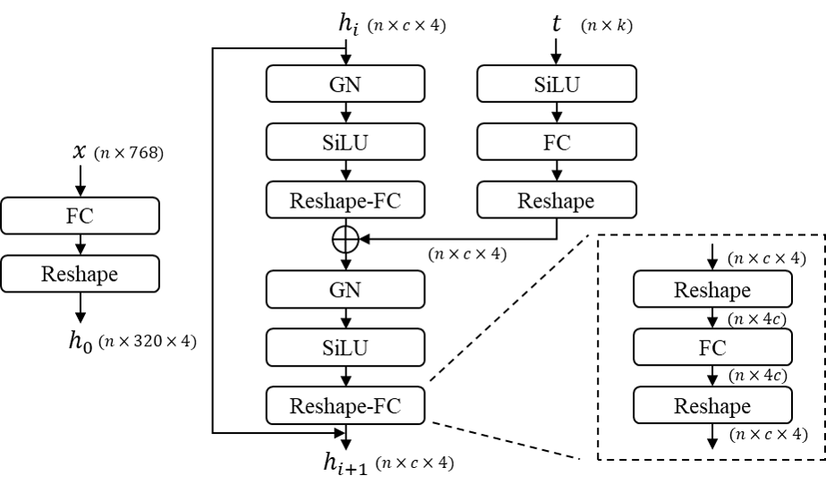
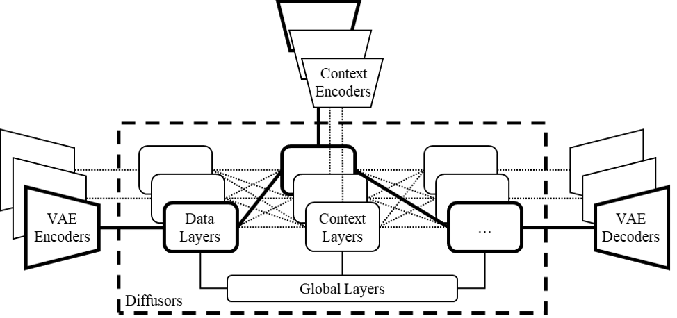

# Versatile Diffusion

[](https://pytorch.org/)

This repo hosts the official implementary of:

[Xingqian Xu](https://ifp-uiuc.github.io/), Atlas Wang, Eric Zhang, Kai Wang, and [Humphrey Shi](https://www.humphreyshi.com/home), **Versatile Diffusion: Text, Images and Variations All in One Diffusion Model**, [Paper arXiv Link coming soon].

## News

- [2022.11.12]: Repo initiated

## Introduction

<p align="center">
  
</p>


**Versatile Diffusion (VD)** is a four-flow diffusion model that parallely handles text-to-image, image-variation, image-to-text, and text-variation. From which we extended to a generalized multi-flow multimodal framework that can further be expanded into other modalities and other tasks, such as image-to-audio, audio-to-image.

## Network and Framework

One single flow of VD contains a VAE, a diffusor and a context encoder, and thus handles one tasks (e.g. text-to-image) under one data type (e.g. image) and one context type (e.g. text). And the multi-flow structure of VD shows in the following diagram:

<p align="center">
  
</p>

<p align="center">
  
</p>


According to VD, we further proposed a generalized multi-flow multimodal framework with VAEs, context encoders, and diffusors that contains three types of layers (i.e. global, data, context layers). To involve a new multimodal task in this framework, we bring out the following requirements:

* The design of core diffusor should contain shared global layers, swappable data and context layers that will be correspondingly activated based on data and context types.
* The choice of VAEs should smoothly map data onto highly interpretable latent spaces.
* The choice of context encoders should jointly minimize the cross-modal statistical distance on all supported content types.

<p align="center">
  
</p>

## Performance

<p align="center">
  
  
  
</p>

## Data

We use Laion2B-en with customized data filters as our main dataset. Since Laion2B is very large so typical models trained less than one epoch, we are the same.

Directory of Laion2B for our code:

```
├── data
│   └── laion2b
│       └── data
│           └── 00000.tar
│           └── 00000.parquet
│           └── 00000_stats.jsom_
│           └── 00001.tar
│           └── ...
```

These compressed data is generate with img2dataset API [official github link](https://github.com/rom1504/img2dataset).

## Setup

Coming soon

## Pretrained models

Coming soon

## Evaluation

Coming soon

## Training

Coming soon

## Citation

Coming soon

## Acknowledgement

Part of the codes reorganizes/reimplements code from the following repositories: [LDM official Github](https://github.com/CompVis/latent-diffusion), which also oriented from [DDPM official Github](https://github.com/lucidrains/denoising-diffusion-pytorch).
